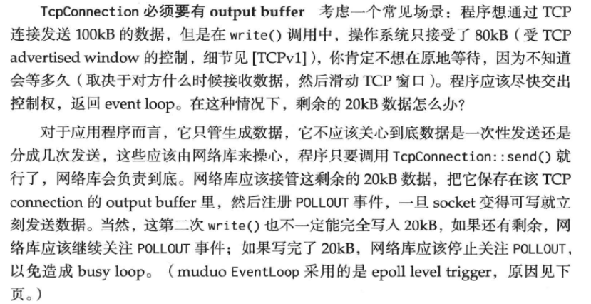
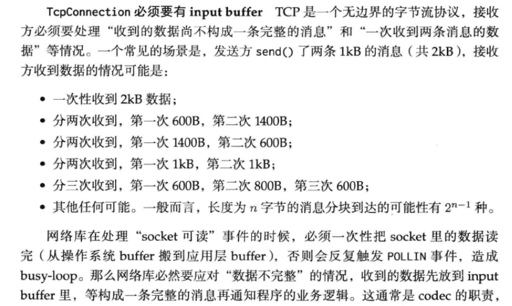

## IO复用总结与网络编程中的一些经验

> IO复用，复用的是线程而不是IO；epoll=event+poll。

### 杂乱的

* 关闭SIGPIPE
* 避免服务器处于TIME_WAIT
* nagle与TCP_NODELAY
* RST分节产生的统计
* 断开TCP连接的正确做法

**关闭SIGPIPE信号**

sigpipe信号的产生：

向已经关闭的TCP连接写数据。比如客户端直接使用close关闭了socket，服务器依然写数据，这时服务器会收到RST segment，在这种情况下再次调用write会产生信号，默认关闭服务器。

向一个已关闭的 socket 或 pipe 写入数据，send() 会返回 -1，errno 为 EPIPE，同时系统会发出一个`SIGPIPE`信号给进程。

**避免服务器处于TIME_WAIT状态**

在协议设计上面让客户端主动断开。这样的关闭还有一个bug，如果接收方不close呢？使用定时器来检查TCP连接。

**RST分节产生的情况**

https://blog.csdn.net/yusiguyuan/article/details/22885667

RST是tcp复位标识，用来关闭异常的连接。**对于产生RST**的一方来说（tcp连接后便是对等的），当需要使用RST来关闭连接的时候无需等发送缓冲区发送出去，而是直接丢弃（RST 分节没有payload）；**对于接受到RST的**一端来说不需要发送ack来回应。

1、TCP接收缓冲区的数据没读取直接close（这个也引出了优雅的断开TCP连接的话题）

- 发送方：send() → shutdown(WR) → recv() == 0（由接收方 close 导致） → close()
- 接收方：recv() == 0（由发送方 shutdown 导致） → more to send? → close()

https://ysw1912.github.io/post/network/how_to_close_tcp_connection_correctly/

这样的关闭还有一个bug，如果接收方不close呢？

https://segmentfault.com/a/1190000017411330

**正确的关闭tcp**

### epoll总结

https://idndx.com/the-implementation-of-epoll-1/

LT与ET模式下对EPOLLOUT时间的关注事件。

LT（默认）是高电平触发，ET是电平变化触发。下面我们声明什么是高电平与低电平。

* 高电平：对于POLLIN来说接受缓冲区可读，对POLLOUT是发送缓冲区可写
* 低电平：TCP接受缓冲为空；TCP发送缓冲满了

### non_block IO

非阻塞IO的使用要配合我们的应用层的缓冲区。

为什么我们需要应用层缓冲？（我们使用write是想TCP的发送缓冲写数据，只要发送缓冲没满就可以一直发；read是从TCP的接收缓冲里面取数据）

这里也提出了我们什么时候需要关注（e）pollout时间。

这个缓冲区的管理也让人头大。

read一般只有eof才会返回0，非阻塞的使用会没有数据会返回EAGAIN，建议读一下

* man open
* man write
* man read
* man epoll

