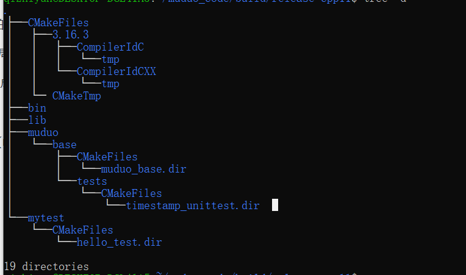

## cmake的使用

```cmake
cmake_minimum_required(VERSION 2.6)

project(pas CXX)

set(CXX_FLAGS -g -Wall)
set(CMAKE_CXX_COMPILER "g++")
string(REPLACE ";" " " CMAKE_CXX_FLAGS "${CXX_FLAGS}")

set(EXECUTABLE_OUTPUT_PATH ${PROJECT_BINARY_DIR}/bin)

add_executable(echosrv_poll echosrv_poll.cpp)
add_executable(echocli echocli.cpp)
```

```bash
mkdir build 
cd build
cmake ../
```

或则使用脚本

```bash
#!/bin/sh

set -x #显示所有命令

SOURCE_DIR=`pwd`
BUILD_DIR=${BUILD_DIR:./build}
# 或者在上级目录构建
# BUILD_DIR=${BUILD_DIR:../build}

mkdir -p $BUILD_DIR  \
	&& cd BUILD_DIR  \
	&& cmake $SOURCE_DIR  \
	&& make $*
```


在使用脚本的使用我们可以

```bash
./build.sh clean  # make clean
./build uninstall # make uninstall
#脚本得学习，make得学习，cmake必须学
```

不管我们如何构建，我们的源文件是不会受到影响的。（在上级目录build）


通过cmake生成的makefile定义的已经非常好了，比如啥clean，uninstall，install

### 讲解

分析下今天看的源代码的cmake文件。

我们修改了全局（整个工程）的cmake文件，还有base文件下的，添加了mytest文件夹。

base下我们生成的是lib库，里面有一个test。都在build下。


我们的build（release）文件夹。



可见我们的build目录结构也和我们的工程（源）目录的结构类似。（取决于我们CMakeLists.txt的写法）。

在这里也生成了全局的makefile与我们的局部的（比如tests，mytest文佳相关的）

看一下muduo的cmake文件，学习下
