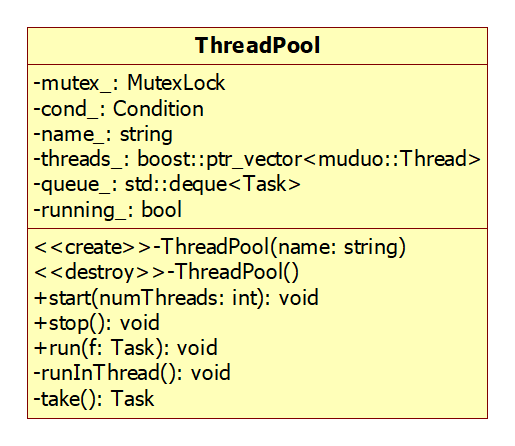
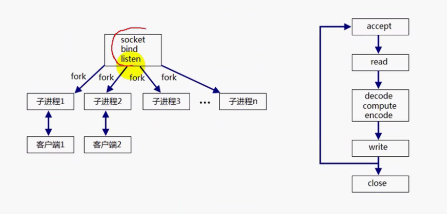

## muduo_base分析

[TOC]


*这个文件夹(base)下大多数与网络库无关的代码，也是用户可见的*  test文件夹下是一些测试文件。

* 值类型，可拷贝的,C++的对象大多都是值语义
* 对象类型，要么不能拷贝，要么拷贝后与源对象关联。

这个应该就是C++对象的语义。

muduo::copyable，模仿boost，一个空基类（标识类），保证我们的类为值类型。


### Timestamp分析


* Timestamp的封装
* 使用PRID64来跨平台，跨平台的做法，由于int_64在不同机器上的表现
* 测试代码
* boost::less_than_comparable，只要我们实现了小于&&等于，为我们自动实现其他的（感兴趣可以看一下）

计算机时间的表示，从UNIX元年开始计数的秒数。

int64_t跨平台的做法。但是现在貌似不用了，这个方法。在inttypes下没有看到。

```C++
#ifndef __STDC_FORMAT_MACROS
#define __STDC_FORMAT_MACROS
#endif

#include <inttypes.h>
```

通过这个例子，主要学习了cmake的使用，通过改写muduo的源构建文件来适应我们的代码。


添加测试代码。也要为它添加cmake文件。


### Atomic分析

最后总结下C++的atomic，做下对比。我们一般也就仅仅使用原子int操作

封装原子操作：

* GCC原子性操作
* Atomic.h封装
* 编译选项：-march=(cpu-type:我们直接使用native) native（本地）
* volatile的使用
* 原子操作实现无锁队列
* 一些编译选项学习

**gcc的原子操作**

这些操作都会返回原来的值old_va;,emmm有的特殊些。

compare_and_set比test_and_set更强大。这些原子操作都可以来构建spin lock。

```C
// 原子自增操作，返回原来的值
type __sync_fetch_and_add(type* ptr,type value);

//原子操作：设置newval，返回oldval，原子比较，设置。首先compare原来的值是不是old
// 比较成功才会去设置，这个一般用来get一个值?（设置更准确一些）
//先去比较，和oldval相等会去设置为newval。返回old
type __sync_val_compare_and_swap(type* ptr ,type oldval,type newval);
//先去比较，比较成功返回true（并设置newval），和old不相等返回false，不设置
bool __sync__bool__compare_and_swap(type* ptr,type oldval,type newval);


// test——and——set我们可以使用这个实现一个spin lock，，就是os课那个
//就是赋值操作，并返回原来的值。
type __sync_lock_test_and_set(type* ptr,type val);
 
```

**volatile**

使用volatile声明的变量，用来防止编译器对它的优化。

当使用volatile的变量的时候，系统总是重新去它的内存读取数据，而不是使用寄存器里的备份。

一个例子：(算了这个例子有点晦涩，知道的了)


**编译选项**

P11：第32min讲解

```cmake
set(CXX_FLAGS
 -g
 # -DVALGRIND
 -DCHECK_PTHREAD_RETURN_VALUE
 -D_FILE_OFFSET_BITS=64
 -Wall    #大部分警告
 -Wextra  #一些额外的警告，很全面
 -Werror  # 把警告转化为error停止编译
 -Wconversion  #隐式转型也会报错，我们要明确什么使用implicit cast
 -Wno-unused-parameter  # 没有使用的参数不警告，对上面extra的减弱
 -Wold-style-cast
 -Woverloaded-virtual   #overload了虚函数（而不是override），隐藏了虚函数
 -Wpointer-arith
 -Wshadow
 -Wwrite-strings
 -march=native  # 匹配本地cpu
 # -MMD
 -std=c++11
 -rdynamic
 )
```


**types文件分析**

定义了：隐式转型implicit_cast，与指针的向下转型（基类转派生类）。

我们编译的时候要开启提醒隐式转换。type里面的implicit有何用？


dynamic要在RTTI下使用。

我们常用的也就是原子int了。


### Exception类的实现

* 查阅man backtrace ,  backtrace_symbols
* backtrace，栈回溯，保存各个栈的地址
* backtrace_symbols根据地址转化为相应的函数。
* CurrentThread.cc，里面除了stacktrace其他的不知道干啥
* `__thread`  keyword

CurrentThread里面的stackTrace很不错。


*测试程序里的lambda与function为什么没有栈展开，难道不是函数还是其他？*

汇编查看后：不优化的话是栈展开，优化后就不是了。


继承自std::exception。在构造函数里面，记录栈的信息。

分析下这个异常。

从18分钟再看一下。demangle。

### 线程相关封装

这里面的一些类的封装使用了编译器的`__attribute`emmm,我们看看要不要查一下吧。

P13+P14.

今天就先看完muduo线程的封装。(昨天没看完，再看一下)

在这分析下muduo线程相关类的封装。这里还使用了一个日志操作，（暂时注释掉）待会分析下。

Thread的封装依赖于以下：

* mutex封装
* CountDownLatch：
* condition封装，条件变量
* CurrentThread

基于对象的方法封装thread。

+++++++++++++++++


看下封装，写一下测试程序。

* mutex ok
* condition  ok
* countdown  ok
* CurrentThread   ok
* thread   ok

测试代码：测试与c++11的差距？

thread类的start方法，不是会阻塞吗？那还使用join干嘛呢？start+join得一块？

thread类的设计很棒，

```C++
class ThreadNameInitializer
{
 public:
  ThreadNameInitializer()
  {
    muduo::CurrentThread::t_threadName = "main";
    CurrentThread::tid();
    pthread_atfork(NULL, NULL, &afterFork);
  }
};

ThreadNameInitializer init;
// 什么意思，实例化一个对象，
//目前没有使用过这个，在一个namespace里实例一个对象干嘛？可能以后线程会用吧
```


++++++++++++++


**学习**

`__thread`关键字修饰的变量，是线程局部存储的。但是只能修饰POD类型（plain old data），C++的话必须是编译期确定的常量（不能构造）。如何修饰非pod类型？*线程特定数据？tsd*


```C++
static_assert(std::is_same<int, pid_t>::value, "pid_t should be int");
//判断类型是否相同
```


`pthread_atfork()`

在muduo里的使用，ThreadNameIniter。

fork可能在主线程里面调用，也可能在一个子线程里面调用（调用fork的那个线程会被继承下来）。我们希望通过这个函数对fork后的子进程进行改变。在muduo里面就是改变子进程的名称与tid。**Finally，最好不要再多线程下使用fork。**多线程+多进程容易deadlock。

不像file struct（fork只会dup一个fd）；我们的锁在fork的时候是会被复制的，也会复制锁的状态。（但是为啥要在多线程里使用fork呢？）


thread里面的实现看一下，tid，type_traits干啥的？

**mutex**

P14

mutex这个依赖少。

封装两个类：

* MutexLock
* MutexLockGuard

这两个类之间是关联关系，lockguard使用了mutexlock。

聚合关系：整体与局部。

组合关系：不仅仅是整体与局部，还负责生成与销毁。

*finally*测试一下自己实现与c++11的测距？

```C
#else  // CHECK_PTHREAD_RETURN_VALUE

#define MCHECK(ret) ({ __typeof__ (ret) errnum = (ret);         \
                       assert(errnum == 0); (void) errnum;})

#endif // CHECK_PTHREAD_RETURN_VALUE
//debug模式下我们使用assert，
//(void) errnum;这句话因为我们开启了gcc的未使用变量报错，虚假使用一下。 
 MCHECK(pthread_cond_init(&pcond_, NULL));
//使用方法就是这样，应该比wrapper好一点，可以条件编译。
```


**condition**

条件变量

和lock_guard一样使用mutex，不负责生存期。


**CountDownLatch**

这个countlatch是干啥的？

倒计时门闩。

* 所有子线程等待主线程发起“起跑命令”：主线程通知子线程
* 主线程等待所有子线程初始化完毕。（子线程通知主线程）

```C++
wait();//latch>0就阻塞，等待latch=0的信号，
//发令枪程序。其实就是线程间的同步,但是不知道为啥起个这样名字QWQ
countdown();//
```


用途？

我们的测试程序。自己编写测试程序。（测试子线程通知主线程&&主线程通知所以子线程）

测试：（其实就是条件变量）

**final**

经过这些类的封装，基本能够完成我们的大部分使用了。今天晚上，在看一下写几个程序测试他们的性能。*看下thread的设计，线程的生命不应该受到我们Thread对象的影响。*


```te
 1、t5 may destruct eariler than thread creation.
 2、这个测试是看，我们的线程thread对象先于新创建的线程而被析构掉了，但是不应该对线程照成影响。
 3、我们新创建的线程运行后会自动delete我们的thread data，无内存泄露。
```


**线程所有相关的东西封装完毕，接下来实现几个常用的实例**

**使用c++的线程来实现一下**，关于c++线程库的一些迷惑地方，以及猜测。join仅仅就是用来连接线程（以及改变joinable）和C语言一样（实验下，这样才合理），线程只要创建就有机会调度（而不是等到join）。我们可以使用CV来让主线程来等待。（封装下CountDownLatch或许更方便）

看源码：C++thread构造函数也是使用pthread_create，所以原理一样。

muduo::CurrentThread的name变量应该是没有用的。

### 阻塞队列实现

* 无界缓冲区
* 有界缓冲区，多一个判断罢了。

无界的阻塞队列，仅仅需要一个条件来通知（阻塞）消费者就好了。*not_empty*    


有界的阻塞队列，两个条件，一个用来通知（阻塞）生产者；一个用来通知（阻塞）消费者。

*not_empty&&not_full*


*生产者，消费者问题：*

emmm，PV操作又忘了，

P是申请资源，V是释放资源（pv原语真恶心）pv原语是信号量的东西（这玩意我们完全不使用）。

> P原语：P是荷兰语Proberen（测试）的首字母。为阻塞原语，负责把当前进程由运行状态转换为[阻塞状态]，直到另外一个进程唤醒它。操作为：申请一个空闲资源（把[信号量]减1），若成功，则退出；若失败，则该进程被阻塞；**先减一，小于0，阻塞**

> V原语：V是荷兰语Verhogen（增加）的首字母。为唤醒原语，负责把一个被阻塞的进程唤醒，它有一个参数表，存放着等待被唤醒的进程信息。操作为：释放一个被占用的资源（把信号量加1），如果发现有被阻塞的进程，则选择一个唤醒之。**先加一，大于等于0唤醒。**

信号量初值为1的话，就是用来互斥。

我们可能有多个生产者，或则多个消费者，我们需要互斥使用队列。

条件变量的话，就是抽象为某种条件。

相比下，条件变量好理解，wait就是等条件，signal就是发信号。

使用countdown让主线程等待子线程。


### 线程池的实现

P16

还是生产者与消费者的问题。



一个简单线程池的类图：

`typedef function<void()> Task`

**什么是一个任务？其实就是我们（收到请求）需要使用某个函数来“加工”某些数据的东西。**

为什么使用线程池：

* threads：`vector<std::unique_ptr<muduo::Thread>>;`不知道线程池为什么使用指针
* queue：任务队列，emmm应该就是一个有边界的阻塞队列吧。把任务加进去我们就不用管了，等待线程池来自己获取task（run其实添加任务）生产者消费者模型吧。

run：生产者，take消费者。

线程池的模型，也是一个生产者&消费者问题。关键就是：1、看是不是有边界的：（影响条件变量的个数），2、找到生成任务的，找到消费的。

目前把所有的log信息都注释掉了，看完log再回来。


### 线程安全的Singleton

现在还需要加锁吗?

一个实例：我们的库里面希望有一个全局的对象，但是禁止外部访问。


保证一个类仅仅有一个实例，并且提供全局的访问。

**T_must_be_complete_type：这个还不知道有啥用，不要再这些地方纠结，先把握大致逻辑**


这里我们可以使用一个智能指针来替换`atexit()`

这里的如何判断有没有nodestory方法的看不懂啊。

[emmm，模板编程黑魔法。在编译期就判断，有没有一个成员函数。](https://stackoverflow.com/questions/257288/templated-check-for-the-existence-of-a-class-member-function)


完成一个基于c++的singleton。

我们不使用这个模板类的对象，仅仅使用它的instance（static）方法，不需要对象来调用。

单例模式，不是说我们有一个singleton类的对象，而是对于泛型T，只有一个这样的（instance）对象。


### 线程本地存储ThreadLocal

P18

**线程特定数据**

* POD类型，plain old data
* TLD：thread-specific-data线程特定数据，也叫做线程局部存储。
* POSIX线程库通过维护一定的数据结构来解决这个问题，这个些数据称为（Thread-specific Data，或 TSD）。

不太懂，啥是线程私有的全局变量？在我们的CurrentThread的例子里面。一会看看。就是和在现场的存储区域存放一些同名的数据。

```C
  // __thread修饰表明这是个线程特有的
  extern __thread int t_cachedTid;
  extern __thread char t_tidString[32];
  extern __thread int t_tidStringLength;
  extern __thread const char* t_threadName;
```

在全局定义，但是每个线程都拥有一份这个同名字的数据（数据存储在线程的存储）互不干扰。

```C
pthread_key_create();
pthread_key_delete();
pthread_getspecific();
pthread_setspecific();
```

在main函数里面定义的是main线程的。


### ThreadLocalSingleton封装

P19

每一个线程一个signalton对象。每一个线程一个单例类对象。

与一个全局的singleton的区别？

如何使用sp改进。

目前还不知道这种东西是威力。

单列对象：全局仅仅一个，自然的问题-->什么时候销毁它，使用sp我觉得很OK了，看下这里。

每个线程一个，就不要啥线程安全了。

### 日志类相关封装

#### 概述


**为什么使用日志：**

* 调试错误
* 更好理解程序
* 诊断系统故障
* 记录系统运行状态

*调试错误：*          

运行时（日志）把错误信息记录下来，

系统的逻辑错误及其难调试，我们使用日志记录下系统的运行，然后分析。       


*理解程序：*

在阅读代码的时候，加上日志，来看看程序运行。（为什么不使用cout？）日志不影响系统的运行。


**日志级别：**（补充）

* TARCE：比debug粒度更细。（开发过程使用）
* DEBUG：帮助我们的调试信息
* INFO：强调应用程序的运行过程
* WARN：系统可以正常运行，但是会出现潜在的错误
* ERROR：错误发生了，但是系统没有挂掉
* FATAL：指出每个严重的错误事件将导致整个应用程序的退出。

日志应该可以指定输出的文件。logger对象可以指定

```C++
Logger::LogLevel initLogLevel()
{
  if (::getenv("MUDUO_LOG_TRACE"))
    return Logger::TRACE;
  else if (::getenv("MUDUO_LOG_DEBUG"))
    return Logger::DEBUG;
  else
    return Logger::INFO;
}
//通过环境变量来改变，log级别？
Logger::setLogLevel(Logger::TRACE);
```

C/C++语言几个全局对象：

```C
__FILE__;
__LINE__;

```


**相关类及其分析**

* LogStream.h  缓冲区相关
* Logging.h   输出信息相关

> 20211020 08:55:09.290994Z  3452 INFO  info... - Log_test1.cc:11
> 20211020 08:55:09.291070Z  3452 WARN  warn... - Log_test1.cc:12
> 20211020 08:55:09.291075Z  3452 ERROR error - Log_test1.cc:13

从log信息推测大致的实现步骤。


*大致的流程*

一条log语句的大致流程。（临时（匿名）对象的构造与析构）      

打印到哪？什么格式（这些都是Logger类的全局配置，set）          

* Logger：日志类
* Impl：实际的实现，一个嵌套类，目前看来仅仅是为了简化代码
* LogStream：操作<<， 我们的缓冲区类，重载了<<
* 使用<<之后（格式化后的string）并没有直接去目的地，而是先去缓冲区FixedBuffer
* ​               *这上面的全是一条log语句（会生成一个临时对象）干的*
* 做完上面那些，在临时对象（Logger）析构的时候，写进文件
* 最后把缓冲区数据输出到对应的设备/file：g_output（源文件定义的默认是stdout）
* g_flush:如果设备（比如标准输出）还有缓冲（标准输出是行缓冲），我们需要flush一下


*枚举类，嵌套类*

g_logLevel与g_output和g_flush都是全局的数据，我们在使用日志之前需要进行设置。


#### 分析

**Logger**类

先从一条log语句说起。`__FILE__` `__LINE__`当前文件的信息。

```C++
LOG_TRACE<<"trace...";//这是一个 marco define
// equal to...    一个匿名对象的构造与析构（Logger的构造委托里一个嵌套类）
Logger(__FILE__,__LINE__,Logger::TRACE,__func__).stream()<<"trace...";
//实际返回一个logstream对象。只有logstream重载了output
//完成这个就输出到缓冲区
```

Logger对象的构造太多，这里使用一个嵌套类，嵌套类的构造`Logger::Impl::Impl`

在stream()的重载<<我们也可以看到，使用<<后也仅仅是把数据放进了缓冲区。

stream是logstream对象。

* 先构造一个无名的Logger对象。
* 通过对象调用stream函数
* stream函数重载operator<<

`Logger  =>  Impl  =>   LogStream=>    operator<<`

Logger类的析构，发生文件的写入。


**LogStream**

这个类的主要作用，重载output。还有缓冲区。（这里有一个缓冲区，我们的文件也有一个）


Logger构造的时候使用stream方法（其实是使用了logstream对象），将日志信息输出（重载output）到缓冲区（此时还没有输出到文件）。


看到一个比较有意思的代码，数字转换字符串。

```C++
const char* digits[]="9876543210123456789";
const char* zero=digits+9;
template<typename T>//转化为10进制
size_t convert(char buf[],T value)
{
    T i=value;
    char* p=buf;
    do
    {
        int lsd=static_cast<int>(i%10);
        i/=10;
        *p++=zero[lsd];
    }while(i!=0);
    if(value<0)*p++ ='-';
    std::reverse(buf,p);
    //左闭右开区间
    return p-buf;
}
// 转化为16进制同理
const char* digitsHex[]="0123456789ABCDEF";
size_t convertHex(char buf[],uintptr_t value)
{
    uintptr_t i=value;
    char* p=buf;
    do
    {
        int lsd=static_cast<int>(i%16);
        i/=16;
        *p++ =digitsHex[lsd];
    }while(i!=0);
    *p='\0';
    //这里为什么需要这个
    std::reverse(buf,p);
    return p-buf;
}
```


logstream的责任就是负责一条log语句里面的信息给缓冲起来。   

重载output，保存在缓冲区。


**stringpieces**类

P21；50min


目前感觉就是多了一层。

用来实现高效的字符串传递，使用const char*的效率和string的效率一样，并且不涉及内存拷贝。

```C++
const char* str="hello";
std::string str2{"world"};

void foo(const StringPiece& x);
//接受上面的两种类型

void foo_1(const string& st);
//同样可以接受两种，但是有内存拷贝
```

*C++的string_view()*


这个还可以看看。

还有一点介绍`type_traits`

看本书吧，《c++ template》


emmm,还不太明白，type_traits

```C++
// This makes vector<StringPiece> really fast for some STL implementations
template<> struct __type_traits<muduo::StringPiece> {
  typedef __true_type    has_trivial_default_constructor;
  typedef __true_type    has_trivial_copy_constructor;
  typedef __true_type    has_trivial_assignment_operator;
  typedef __true_type    has_trivial_destructor;
  typedef __true_type    is_POD_type;
};
```


*昨天大致熟悉了logger类的整体与实现，今天看一下细节*

* 看三个类的封装及其实现
* 记录下昨天看的设计模式


#### 日志滚动

默认是输出到stdout，使用logfile来指定文件。


自动更换日志文件。


前面的实现对于一个单个的日志文件已经足够了，但是对于我们高性能服务器（7*24）不可能仅仅一个文件吧。


日志滚动（产生新的日志文件）的条件：

* 文件大小，比如每写满1G换一个文件
* 时间：每天时间一到新建一个文件

一个典型的日志文件的名称。

`logfile_test.20211021-065130.DESKTOP-DGL41A5.1676.log`

测试文件，年月日，时分秒，主机名称，进程id；名称包含这些信息。


对象析构的时候会把logstream里的缓冲区给刷新下（进入文件，一条语句写一下文件必然低效，LogFile类有必要提供一个缓冲区）。那么我们的日志文件啥时候滚动一次。LogFile对象是全局都可写入的file。     

如果提供了LogFile的缓冲，得到问题：

* LogFile的缓冲什么时候写入文件
* （缓冲区自然引出）线程安全问题


Logger对象的setoutput函数。

* 确定的是每次析构这个对象都要吧logstream缓冲区给写进去（使用logfile的append）


分析：`LogFile`  `FileUtil`  `ProcessInfo`


LogFile是支持多线程同时写入的，但是效率有点点下降。但是对于多线程这里的方法仅仅是mutex互斥的方法。加锁的时机在哪？临界区就是一个LogFile的缓冲区，应该是对（logfile的）append方法加锁.

```C++
// 直接缓冲区加锁的方式，经过测试效率比只使用一个线程效率低
void LogFile::append(const char* logline,int len)
{
    if(mutex_){
        MutexLockGuard lock(*mutex_);
        append_unlocked(logline,len);
    }
    else{
        append_unlocked(logline,len);
    }
}
```


**LogFile缓冲区**

logfile含有一个AppendFile对象，这个对象构造的时候通过`setbuffer`来改变stdio的默认缓冲区。改为64KB，我们需要自己管理吗，应该是不需要的，代码里也没，想想也是，如果改变好需要自己管理，不如不改。


*突然的想法，不知道c++的输入输出语句有何作用QWQ*


基本上也就分析完成了。

```C++
// 滚动日志的条件
if(file_->writtenBytes()>rollSize_) rollFile();//写入数据大于我们指定的size
else
{
    ++count;
    if(count>=1024)
    {
        //新开始一天 rollFile()
        // 其他情况flush一下就ok
    }
}
```

**FileUtil**

一些文件的基础操作，读文件和写文件分开了（两个类），read操作直接使用系统调用（read这些）；写文件Append类，使用的FILE*，并且自己指定了文件的stdio缓冲。


看一下这个的测试程序


muduo的基础库大概看完了，测试程序这几天来看一下。

+++++++++++++++++++++++++++++++++


### 异步日志

每个线程都有写日志的需求，如何保证日志的正确写入文件?            

* 每个线程都真正的写入文件，这种情况需要对文件的写入加锁来避免race condition
* 使用专门的写入文件线程：生产者--消费者模型，log线程生产，写入来消费。

消费者线程加入缓冲区来减少文件IO的次数。         

前端写入：

currentBuffer，nextBuffer。            

最少四块缓冲。

后端：       

newBuffer1，newBuffer2


### 多线程设计

* 并发：有处理多个任务的能力，但是不一定在同一时刻处理。
* 并行：在同一时刻处理多个任务。

> 你吃饭吃到一半，电话来了，你一直到吃完了以后才去接，这就说明你不支持并发也不支持并行。
> 你吃饭吃到一半，电话来了，你停了下来接了电话，接完后继续吃饭，这说明你支持并发。
> 你吃饭吃到一半，电话来了，你一边打电话一边吃饭，这说明你支持并行。

muduo推荐的：`one loop per thread (+ threadpool)`


**Linux可以同时启动多少线程**      

一个线程栈的大小是多少？对于32bit的系统，它的用户态是3GB内存。

64位还需要担心吗？


**多线程如何把IO与计算重叠**         


多个线程写日志，但是文件操作比较慢，服务线程会等待在IO，CPU就会空闲（并发不是并行）增加响应时间。      

解决办法：单独用一个logging线程专门进行日志的写入。通过BlockingQueue提供对外的接口。生产者消费者模型，阻塞队列。这样每次仅仅阻塞任务队列就好了。（在内存里面传数据肯定以在磁盘快）      


如何充分利用DMA？    使用同步IO。


**线程池大小的确定**       

一个经验公式。


**线程分类：**         

* IO线程：特指网络IO，reactor（epoll）模式，每个reactor就是一个IO线程
* 计算线程
* 第三方库线程，比如logging与database


#### 常见的并发服务器设计

* 循环、迭代式服务器：就是server迭代调用一连串的例行公事代码

  无法充分使用CPU的多核，不适合服务时间长的程序。

  

* 并发服务器

  一个连接一个线程（进程），这个创建的线程专门服务于这个链接。适合执行时间长的服务


* 预先创建进程，预先创建线程

  问题：当一个客户连接进来的时候，每个子进程（可能）都会accept到这个连接请求。（其实这也是epoll里的一个问题）就是监听套接字可读，但是实际上读不到（可能被其他读走了或则客户取消链接），惊群问题。UNP（27章）





*  Basic Reactor模型，基本的IO复用模型（复用线程）

  select、poll、epoll使用。但是还是使用一个线程。


* Reactor+ thread per request

* Reactor+ work thread

  

* Reactor+ threadPool（计算密集性）

  acceptor就是调用accept来建立连接，Reactor（线程）是一个事件循环（epoll）。

  Reactor是IO线程。（这里的IO和文件IO不同，一般指的是poll事件吧）      

  Acceptor：监听套接字

   

  我们的线程池（处理完客户请求）不会负责数据的发送，而是直接给Reactor（IO）线程。一般处理完请求添加一个事件（可写事件）


* multiple reactors：多个事件循环（适应更大的突发IO）**one  loop per thread**

  * Reactors（事件循环） in thread： one loop per thread
  * Reactors in processes

  每个reactor都是一个线程或者进程。        

  acceptor，监听套接字加入manReactor。当可读时间（客户连接）进来的时候，返回的已连接套接字加入到subReactor.    没有使用线程池，**每个客户连接在它所属的subreactor处理。**


* 更进一步：multiple Reactors+ threadpool（**one loop per thread +threadpool**）

  *IO突发与密集计算*           

  使用的是共享的线程池。

  **这个怎么保证每个客户的连接请求是被它所属的subReactor处理的。？**           

  看完网络库你就明白了，每个IO连接也可以说是每个Channel拥有一个eventloop的指针。

  
  
  


#### 基于异步IO的设计

**Proactor**           

* 同步IO通知的是IO就绪事件          

  比如我们使用的epoll，当通知socket可读的时候需要我们自己去读取。然后去处理。可使用非阻塞，但是IO是我们自己干的。`EAGAIN`  `EWOULDBLOCK`       自己从内核取到应用层缓冲区。        

  


* 异步IO通知的是IO完成事件

  比如我们调用`aio_read`，当进入内核的排队队列的时候就会返回。然后通过信号来通知我们。这个时候应用程序调用相应的信号函数（或者回调函数）来相应这个IO完成事件     

  ​            

  这个的优点，计算任务在执行的时候内核为我们IO。**并行**         

  

  异步IO很厉害，但是难实现。

  * `man 7 aio`     
  * `man fsync`

  

  

  


