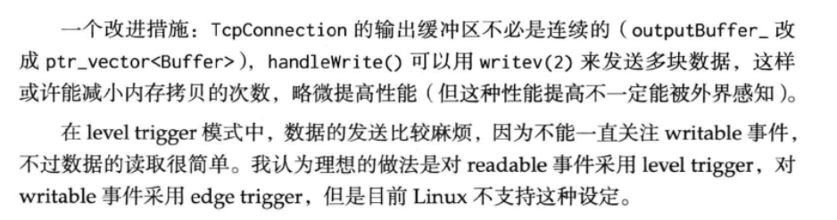

## muduo_net库分析

**这一部分建议先看一下配套的书籍**          


主要看muduo_net里面关于网络相关的实现。也是muduo库的核心。    

muduo的网络模型：

`one loop per thread + threadpool`        


先学着吧，等看完了再去试着改写。


**网络编程的本质：**       

网络编程其实是使用socket来完成我们跨主机之间的进程通信，不仅仅是几个socket API的调用。

学习这些是我们更好的理解，我们要做的最重要的还是程序逻辑的处理。能够完整的接受数据发送数据就足够了。        


* 连接建立：服务器accept（被动）接受连接，客户端connect（主动）发起连接。
* 连接断开：这里面有一点点小坑。主动断开（close、shutdown），被动断开（read返回0）。
* 消息的接受与发送：
  * 文件描述符可读，核心事件。
  * 消息发送完毕，数据写入TCP的发送缓冲。（这个有时候仅仅对于高流量服务关心一下epoll_out事件，对于低流量服务（比如echoServer）我们可以不关心这个事件


一般网络库也就是要为我们提供上面的这些便利。


>   *接收信息：*    主要事件
>
> 网络库里面的事件循环（eventloop）有可读事件到来，将数据从内核缓冲移动到应用层缓冲。muduo里面到达应用层缓冲会回调一个`onMessage`函数，它会根据协议（协议必然是我们自己定义的）来查看这是不是一个完整的数据包。如果不是一个完整的数据包就会存放在（网络库）应用层缓冲（其实也不太对，现在我是从网络库的角度在说）；当再次有消息从内核到达网络库的缓冲区（非阻塞IO缓冲区是不可避免的）再次回调`onMessage`来判断完整性，最终给我们的就是一个完整的数据包。


>*发送数据*      
>
>1、TCP的发送缓冲足够容纳我们的发送数据，全部发送完毕网络库通过用户注册的回调函数`onwritecomplete`，来进行通知。
>
>​            
>
>2、内核缓冲不足以容纳：发送了一部分，剩余添加到我们的网络库发送缓冲区并注册socket的epoll_out事件，等待下次发送。直到发送完成然后回调函数。高流量服务


++++++++++++


socket可读：tcp的接收缓冲区有数据到达。          

socket可写：tcp的发送缓冲区可写。


数据的完整性以及一些边界问题需要我们自己来设计协议来完整他们。          

### 一些问题

* 网络里面的粘包问题？半包问题？

* Reactors的事件经过threadpool处理后如何添加到它所属的reactor
* 缓冲池的设计


粘包问题：一次没有收到一个完整的数据包，（比如我们的协议一个完整的数据大小是10k）

用户发送了两条10K的数据，可能的情况：

* 一次收到20K
* 分两次：15K，5K（6K，15K）
* 分三次：6K，5K，9K。

这就是粘包问题，一次收不到用户完整的数据包（对应用层来说的），需要我们自己的协议来保证完整性。不完整的话全放在网络库buffer？

缓冲池的设计看一下muduo手册，

readFD结合栈空间。ioctl系统调用。

P36buffer相关以及，为什么使用LT。看下这个课件。


### 网络编程的hello，world：echo分析


TCPServer对应的三个半事件。

```C++
setConnectCallback();//对应的连接的建立与断开
setMessageCallback();//可读事件
setWriteCompleteCallback();//可写事件
```


EchoServer：提供我们所关心的那几个事件的回调函数流量不会很大，不关注发送。

```C++
onConnection();//关心连接的的建立与断开
onMessage();//关心数据的到达。
```

基于对象的思想，EchoServer包含一个TcpServer，不采用虚函数的回调方法而是在EchoServer里面直接设置这些回调函数。        

面向对象的回调一般就是虚函数的调用（override）那些。


**回调函数的形式：**           

```C++
class Buffer;
class TcpConnection;
typedef std::shared_ptr<TcpConnection>TcpConnectionPtr;
//这个tcp可复制？看看代码吧
typedef std::function<void()> TimerCallback;
typedef std::function<void(const TcpConnectionPtr&)>ConnectionCallback;
typedef std::function<void(const TcpConnectionPtr&)>CloseCallback;
typedef std::function<void(const TcpConnectionPtr&)>WriteCompleteCallback;

// the data has been read to (buf, len)
typedef std::function<void (const TcpConnectionPtr&,
                            Buffer*,
                            Timestamp)> MessageCallback;

void defaultConnectionCallback(const TcpConnectionPtr& conn);
void defaultMessageCallback(const TcpConnectionPtr& conn,
                            Buffer* buffer,
                            Timestamp receiveTime);
```


muduo采用的`one loop per thread + threadpool`    多个Reactor（epoll）一个线程池。


```C++
//echo-main函数  
  LOG_INFO << "pid = " << getpid();
  muduo::net::EventLoop loop;
  // 首先定义一个事件循环，event loop，也就是我们常用的epoll。poll
  muduo::net::InetAddress listenAddr(2007);
  EchoServer server(&loop, listenAddr);
  server.start();
// 服务器启动,socket,bind,listeing
  loop.loop();
// 事件循环，不断捕捉事件，事件到来就会回调我们的函数。这里是onconnection，onmessage
```

echoserver单个reactor就足够了，如果在multiple Reactors模式下，上面与地址绑定（listening socket）的就是我们的mainReactor。           


### eventloop的封装：        

`multiple reactors (one loop per thread) + threadpool`           


IO线程：特指网络IO，reactor（epoll）模式，每个reactor就是一个IO线程


muduo网络库的核心，先看一下简化的。

最后再看muduo现代版的吧。


#### V1

net_1            

如何保证一个线程最多一次只有一个eventloop。

使用thread关键字，线程局部存储。

保证loop循环只能被当前线程调用。


#### V2

UML类图基础：          

* 继承（泛化）关系：三角
* 组合关系：拥有并且控制它的生死实心菱形
* 聚合关系：使用了它，但是不控制生死，空心
* 关联关系：fd（socket）与其他类的关系。


eventloop在设计的时候也要考虑统一事件源：

* IO事件
* 信号时间
* 定时器事件


```C++
int epoll_fd=epoll_creat();
epoll_ctl(epoll_fd,...);
while(true)
{
    epoll_wait();
    .....;
    for_loop:     ;
    //epoll_in-->
    {
        //nonblock_io
        //buffer control
    }
    // epoll_out-->
    {
        //nonblock_io        
    }
}
/*
emmm,我们C语言过程化的编写就是这样。这些就是网络编程例行公事的代码，但是我们现在
想写一个网络库，来复用这些例行公事的代码（复用！！！）我们就得使用模块化来组装各个部分。
*/
```


我们很容易把muduo的类图与我们的IO复用模型结合起来。          

白色模块是muduo为用户暴露出来的（对事件的）抽象。      

看一下对象的生命周期控制。      


白色外部可见，

* eventloop对事件循环（什么是事件循环就是poll与epoll_wait啊）的抽象

* poller对IO复用的抽象类，两个派生类，封装poll与epoll都是内部类

* eventloop的loop就是调用poller的poll函数来进行的循环。

* channel是对我们所关心的fd上面的所发生封装，

  比如为fd注册我们所关心的东西(epoll_in  epoll_out  ),负责注册与响应IO 事件，它不拥有file descriptor。

*  TCPserver不控制TCPconnection生命期，一个server可能很多TCPconnection         


把这个关系捋清楚，然后写个小栗子对一下。


增加poller与channel


++++++++++++++++++++++++++++++++++

## 分割线

暂时杂乱的记录：        


muduo库的模型：Reactor    事件dispatch


难题见：TCP网络编程本质


**今日任务：**       

* strace分析
* tcpdump
* telnet
* nc
* netstat
* 使用GDB查看程序的执行过程？


**七步实现finger服务：**        


* 主动断开连接

  server主动调用close进入的time wait状态，导致的端口不可重用。而不是说server直接不可用。


### 第八章muduo设计

Reactor模式的现代C++设计：

```C++
class Channel;
class Eventloop;
class Poller;
class TimerQueue;
class EventLoopThread;
```

Reactor最核心的部分，把IO复用拿到的IO事件分给各个fd的处理函数。       

为什么要提供一个fd的抽象？         

channel需要自己加入或者在poll的pollfd数组里去掉。

eventloop是对poll与epoll的抽象。


TimerQueue数据结构的选择。定时器：从当前的时间找到已经到期的的Timer。          

一般不会使用multi容器。     


Reactor的单线程，非阻塞，并发TCP server网络编程

```C++
class Buffer;
class Acceptor;
class Socket;
class Tcpserver;
class TcpConnection;
```


先看下定时器的使用！


定时器事件，可以在外部线程添加定时器，        

目前定时器事件还是会


TimerQueue可能会通过timerfd来定期的得到一些Timer事件，Timer事件在TimerQueue里面按照顺序排列，每次到一定时间来获取超时的事件。lower_bound();


**一个单线程的Reactor：**        


S03完成了单线程的Reactor，

```C++
// 目前我们完成的是单线程的Reactor，
// 核心事件poll,在这里可以优化比如把任务放进阻塞队列，加一个线程池来加速。
void EventLoop::loop()
{
  assert(!looping_);
  assertInLoopThread();
  looping_ = true;
  quit_ = false;

  while (!quit_)
  {
    activeChannels_.clear();
    pollReturnTime_ = poller_->poll(kPollTimeMs, &activeChannels_);
    for (ChannelList::iterator it = activeChannels_.begin();
        it != activeChannels_.end(); ++it)
    {
      (*it)->handleEvent();
    }
    doPendingFunctors();
    // 在IO线程外部添加进来的，IO空闲的时候会使用IO线程做部分计算任务。
  }
```


定时器的选择方面：尽量避开了信号的使用。采用timerfd相关的函数，来统一IO。

TimerQueue组织所有的Timer，TimerQueue有一个timerfd（channel），这个就相当于我们的心跳函数，每当timerfd被回调，就在TimerQueue里选出超时的Timer。


阅读muduo第八章1~3：

完成一个现代c++的Reactor模型。该模型是单线程的Reactor，但是目前来看很容易拓展一个线程池。

* channel是对所有的IO事件以及它的回调函数的封装
* TimerQueue一个定时器
* Eventloop核心分发机制，使用eventfd作为IO线程的唤醒

TimerQueue是能够跨线程调用的，如何保证它的线程安全，我们通过扩展Eventloop来避免锁的使用。

为方便以后的one loop per thread（方便的创建eventloop线程），我们实现了EventLoopThread类，来很便捷的创建IO线程。        

channel是对fd以及其所关心的回调函数的封装。


先记录下这个最简单的单线程Reactor。现在改为仅仅使用epoll的reactor。

先记录下吧。


P29的唤醒时机讲的很好。

P30看到


**完成一个单线程的网络库依赖于前面的Reactor：**          

对我们封装类的一个介绍：

* InetAddress、Socket、SocketsOps基本的socket以及地址函数的封装

* Acceptor，就是我们的acceptor，listedfd-->channel，需要poll来监听

  ```C++
  void Acceptor::handleRead();
  // core func，与我们的TcpServer一起使用
  ```


* TcpServer：管理所有的已连接tcp连接，还有一个Acceptor在构造对象的时候初始化它。

  

S04：完成了socketAPI的RAII封装，并完成Acceptor的封装。

S05：TCPServer，TcpConnection、的封装没有处理断开连接的情况。在这个测试里我们看下如果客户主动断开会怎样。8.5最后书里面说客户主动断开连接会进入busyloop？没看出来啊。


S06：添加删除TcpConnection，删除的过程是比较麻烦的。       

S06解决了连接的断开，**但是不断开为什么会busy loop？**

时序图见8.6，TcpConnection先handleread读为0，然后handleClose();     

把对应的TcpConnection在TcpServer去除，每个tcp连接都在poll里面有记录。我们还需要

queueInloop来改变poll。从用户层面，只需要一个ConnectionCallback就足够获取TCP的建立与

断开，客户不用理会在TcpServer里面移除一个connection。


变动的类：           

1、channel

*目前可以看懂muduo，但是不理解为什么要设计的这么绕*


**8.7buffer的处理：**        


S07：这里仅仅看了下使用，待会看下实现

Buffer每个TCP连接都得一个，我们如何兼顾内存与效率？      


*数据的接受很容易管理：*

LT足够大的缓冲读取一次，缓冲区足够大一次系统调用。

或者ET模式下反复调用read读到EAGAIN


*数据的发送：*        

8.8        S08

使用LT来关注writable事件。需要write的时候才去关注一下就好。     

LT下关注可写事件的时机：如果缓冲区里的数据一次write写不下的话，我们就要关注可写事件，等下次写完后就不再关注。        

*enablewriting就是poll关注可写事件，一次可写完我们就不关注*

handWrite只有关注可写后才会poll到        

改进措施：     

`vector<std::unique<Buffer>>`



LT模式下关注writable事件在缓冲区发送完成的时候需要取消关注，ET模式下的发送就很简单**看下ET的通知时机**          

test9：echoServer。        

test10：测试send功能         

目前为止还是一个单线程的Reactor网络库，所有的任务都还是在IO线程做，其实对于我们的垃圾httpserver，没有太多计算任务，直接一个reactor也OK。

看下Buffer的设计，然后再次过一下我们的所有程序。前面陈硕说它的read的时候缓冲区设计很好？


buffer的设计：

用到buffer的就是TcpConnection的handleread与handlewrite。             

读取的时候：先把fd的可读信息写进缓冲区writable区域，然后我们在读取缓冲区里面的数据readable。     

写入也是这样：      

非阻塞的写入比读取困难的多，一方面在于什么时候关注writable事件，如果对方故意接收很慢的话呢？

全部数据存放在我们的缓冲区buffer在内存积压？       

我们网络库只负责数据的完整发送与接收。    


S08阅读完毕：        


TcpConnection确实是最复杂的类，首先它是一个channel，需要负责读写，连接的建立与断开。

看下Tcp连接断开的时序图，当loop之后TcpConnection对应的可读事件到来，调用这个连接的handleread函数，（read为0）调用handleclose（对TcpServer进行修改erase），如果没有weak ptr直接回coredump，但是我们的channel有一个weak ptr，在erase之前我们进行提升为shared再进行erase。然后TcpConnection对象就可析构了。


TcpConnectionPtr使用智能指针，它的生命期最不明确。看下时序图，我们在erase之前需要对weak进行提升。


目前的网络都是低延迟的我们需要禁止Nagle算法，也就是TCP开启nodelay选项


RunInloop

接下来就是支持多线程的部分，muduo网络库TcpServer是单线程的但是十分容易支持多线程！！！


TcpClient部分先不看


*概述：*      

我们首先完成了一个现代C++的Reactor，包括：

* poll，eventloop
* fd  channel
* eventfd  wakeup eventloop
* timerfd  TimerQueue

这些就组成了基本的Reactor，接下来添加网络功能，对于Server端来说关注Acceptor，TcpConnection。


网络部分：    

* acceptor 
* TcpServer：
* TcpConnection
* Buffer

一个server管理很多个连接，这里的难点还是在连接的断开与建立。      

这里在网络库加入writable功能。          

最后就是多线程的pool的。归功于runInloop。这里还是用server来管理所有连接，但是IO事件交由其他IO线程处理（runInloop）


++++++++++++++++++

到此为止，muduo课本算是看完了，看下这个视频，完结后就去写项目。


### 看课程记录

P30： eventloopthread的封装。      

到这里为止，课程完成了一个Reactor。没有网络的部分。     


P31：讲解课本没用的网络基本API的封装

* endian
* socketsOps
* socket
* InetAddress


两个项目吧：一个server，一个muduo


```C++
vector<unique_ptr<EventLoopThread>>threads_;
// 使用堆上的内存我们使用这样来管理非常容易。
```

模型是multiple Reactors，这种模式需要线程池？muduo里面一个Reactor即可以IO复用也可以做计算啊（runInloop）。


emmm，再看一下TcpConnection的销毁以及weak ptr起的作用。      


server主动断开连接后（shutdownWR）read返回0，服务器会收到两个事件POLLIN，POLLUP       

客户主动断开只会有POLLIN        

我们要相信TCP，只要我们把信息给了TCP缓冲（send-Q）就可以关闭了，对方如何接收接不接收TCP的工作。


P38：       

any，highwatermarkCallback       


```C++
boost::any;
void *;
//可变类型的解决方案，void*类型不安全

vector<boost::any>any_vec;


```

* 应用编程：直接使用C、C++以及网络库，为我们封装好了底层
* 系统编程：使用系统调用，包括信号的处理 and so on。


P39：对客户端发起连接的支持


### HTTP协议


#### 请求报文


#### 回应报文


### 暂时记录程序


默认的参数只能在定义的时候有（文件声明吧，不是定义）

