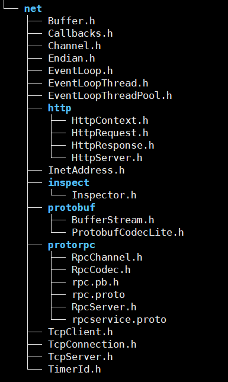

## 简介

non-trivial：有用的，不平凡的

面向对象与基于对象。

reactor模式。

one event loop per thread?

前向声明，简化头文件之间的依赖关系。

库与框架：

序列化与反序列化。

**看书真不能眼瞎，说了安装的方法，可就是看不到**:cry:

使用eventfd（man手册）来代替pipe，作为异步唤醒。（统一事件源？）

### muduo代码结构

主要代码位于muduo文件夹下，

**muduo/base：**

基础库

用户可见的类。可见线程方面使用的自己封装的。

**网络核心库：muduo/net**

poller

基于reactor设计的网络库。同一事件源，非阻塞IO缓冲池。基于对象设计，事件回调使用函数包装器function+bind

（这样做的好处？）今晚看一下，游双的那本书，看下思想。（主要看下reactor与事件回调）

* EventLoop：事件循环，reactor，使用eventfd来唤醒

**库的使用**

需要先安装才会看到include文件夹。（使用者仅需关注这个）

muduo是静态链接的使用方法，看书上面。

###  muduo的编程风格

只暴露具体类，不暴露抽象类，而且不使用虚函数。（不使用面向对象），使用的基于对象。

#### 面向对象与基于对象

**面向对象**

Linux下c++线程的编译。需要使用`-pthread` other than `-lpthread`

使用虚函数的多态来回调，不好吗？

线程对象的生命周期与线程的生命周期是不一样的。(线程池，线程对象使用后就需要释放)

*代码不要拖，看一个写一个！！！！*

### 一些图片

muduo的简化类图

